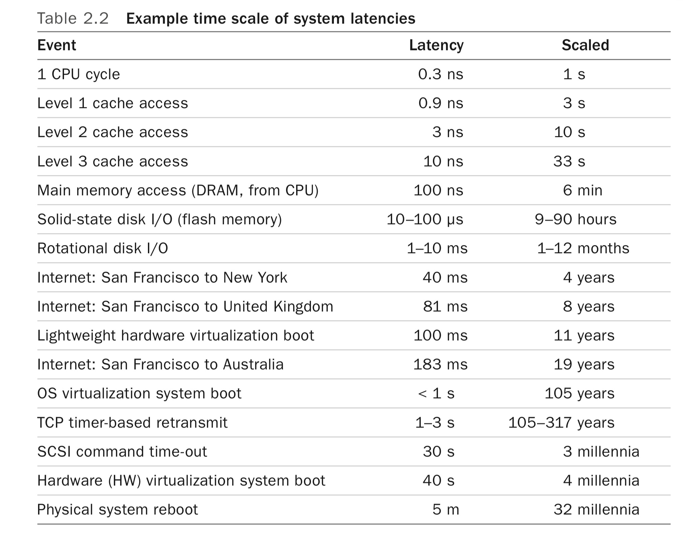
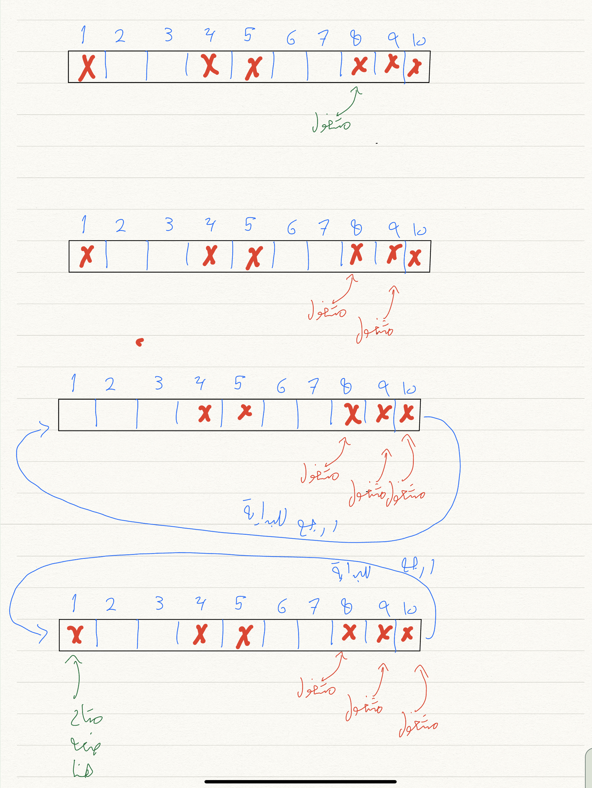
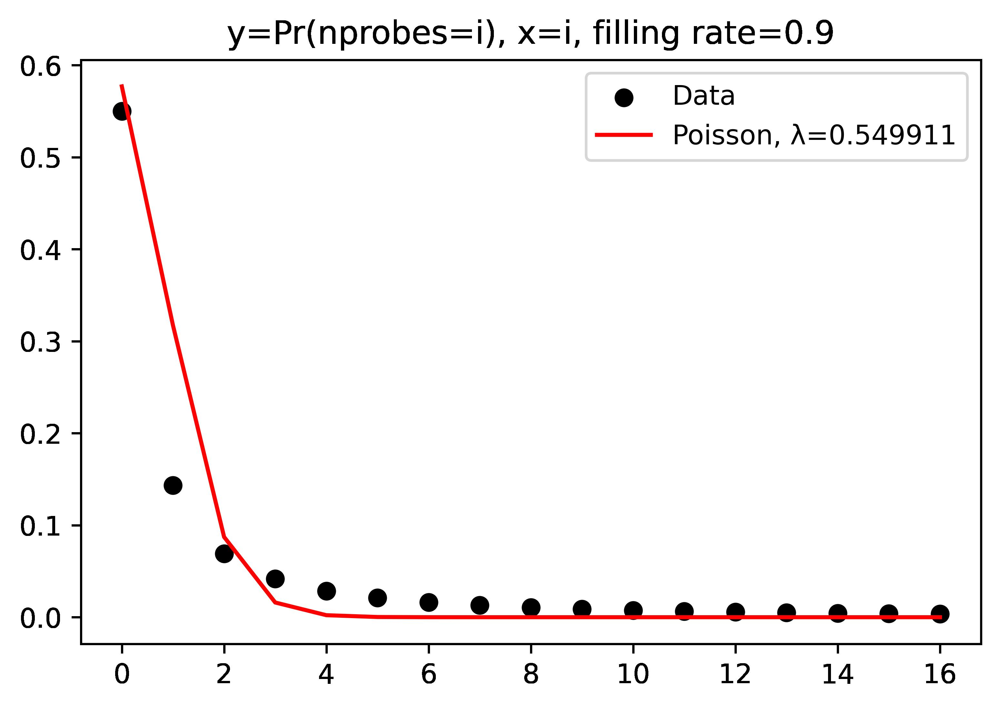

<style>
h1, h2, h3, h4, h5, h6, h7
{
font-weight: bold; // it was normal
}
</style>



## مقدمة

<p dir="rtl">الحالة لدينا كالتالي، في المرحلة الأولى نولد عدد كبير من العناصر شبه العشوائية، ونود أن نخزنها بمصفوفة. في المرحلة الثانية سيكون لدينا مولد ثاني لعناصر شبه عشوائية لنسميه، كل عنصر من المولد الثاني نود أن نتأكد هل يوجد عنصر مثله من المرحلة الأولى.</p>

<p dir="rtl">آخر شهر تقريبا كنا نحاول كل ما يمكننا استخدامه من الذاكرة، نستطيع توليد عناصر عشوائية كما نريد وإن فقدنا أحدها نستطيع توليد عنصر جديد بدلا عنه.</p>

## جداول الهاش

<p dir="rtl">جداول الهاش Hash Tables تتميز بإن البحث فيها تكلفته تقريبا O(1).</p>

<p dir="rtl">
باختصار مخل، لنضغ عنصر x داخل جدول هاش، نحسب دالة  h (نختارها قبل) ويكون موقع العنصر داخل الجدول هو h(x). لنبحث إن x موجود نذهب مباشرة إلى الخانة رقم h(x) ونرى هل x موجود أو لا. 
</p>

<p dir="rtl">مشكلتنا إن عدد العناصر ضخم وأي وأي تقليل بحجم الجدول نحتاجه. مثلا هاش الكوكو Cucko-Hash يتميز بإن البحث فيه يحتاج بالمتوسط لاستدعائين للذاكرة . المشكلة الأولى إن لو كان لدينا ن من العناصر في المرحلة الأولى سيكون حجم الجدول سيكون ٢ن.  مشكلة ثانية هي إن الاستدعائين للذاكرة سيكونان لعنوانين عشوائين لذا سنتحمل عقوبة Cache-miss مرتين. </p>

## مخبأ ملكة الجمال

<p dir="rtl">يترجم قوقل Cache Miss على إنه مخبأ ملكة الجمال، سنترجمها على إنها إخفاق الكاش.</p>

<p dir="rtl">إخفاق الكاش  يحصل عندما يسأل المعالج ذاكرة الكاش عن عنوان من الذاكرة، وعندما يبحث الكاش داخل العناصر المخزنة لا يجده، لذا يطلب الكاش هذا الجزء من الذاكرة من الرام. هذه العملية تستغرق وقت طويل. مثال: لو كان المعالج يجري عملية كل ثانية سينتظر ٦ دقائق حتى تصله المعلومة من الذاكرة.</p>

<p dir="rtl"></p>

<p dir="rtl">الصورة من كتاب 
<a href="https://www.amazon.com/Systems-Performance-Brendan-Gregg-dp-0136820158/dp/0136820158">Systems Performance: Enterprise and the Cloud by Brendan Gregg</a></p>

## السبر الخطي

<p dir="rtl">أحد أبسط جداول الهاش هو السبر الخطي Linear Probing، فكرته لنضع العنصر y داخل الجدول، نحسب h(y) ونذهب للخانة رقم h(y)  (في الصورة افترضنا إن h(y) تساوي 8)</p>

<p dir="rtl">إن كانت الخانة فارغة نضع العنصر فيها، ما عدا ذلك نذهب للخانة المجاورة ونكرر السؤال الخانة فارغة: ضغ العنصر، لا اذهب للخانة المجاورة وهكذا دواليك.</p>

<p dir="rtl">البحث مشابه لإضافة عنصر، مع اختلاف كل مرة ننتقل لخانة مجاورة نتأكد هل هي تساوي العنصر الذي نبحث عنه. نتوقف عندما نصل لخانة فارغة.</p>

<p dir="rtl">عدد المرات اللتي نذهب للخانة المجاورة تعتمد على عدد العناصر الموجودة مقابل حجم المصفوفة، مثل لو كان عدد العناصر الموجودة يساوي عدد المصفوفة فسنزور عدد الخانات ما لانهاية من المرات. بشكل عام  لو كان عدد خانات جدول الهاش هو n وعدد العناصر اللي أضفناها للجدول هي m فسنسمي m/n=α أو معدل التعبئة.</p>

<p dir="rtl"></p>

<p dir="rtl">هذه المسألة هي أول مسألة حقيقية (أو غير تافهة)  حلها دونالد كنوث Donald Knuth. للاستزادة عن تاريخ المسألة اقرأ </p>

<p dir="rtl"><a href="http://aofa2013.lsi.upc.edu/slides/Viola.pdf">50 years of Linear Probing Hashing</a></p>

### السبر الخطي تجريبيا

<p dir="rtl">كنوث حسب عدد المرات المتوقعة نظريا لو كانت الدالة h(x) عشوائية.
أجرينا تجربة على معدلات تعبئة مختلفة</p>

```
alpha, nlookup,        nprobes_lookup
0.50, 6780350 elm/sec, 1.5  probes/elm
0.63, 6456515 elm/sec, 3.15 probes/elm
```
في السطر الأول معدل التعبئة هو نصف، بينما السطر الثاني معدل التعٰبئة ٠.٦٣.</p>

<p dir="rtl">لاحظ هنا لنبحث عن عنصر واحد عدد القراءات في السطر الثاني أكثر من الضعف (٣.١٥ خانة نقرأها) لكن الأداء ما قل للنصف!</p>

<p dir="rtl">هنا أنقذنا الكاش، لأنه عندما يقرأ عنصر من الذاكر سيقرأ عدد من العناصر المجاورة. للمزيد اقرأ عن خط الكاش cache-line. </p>

### تسريع السبر الخطي مع معدلات تعبئة مرتفعة

<p dir="rtl">لنفرض إن لدينا سيرفر حجم الرام تقريبا٣٧٠ قيقابايت واستهدفنا معدل تعبئة ٩٠٪، ولنفرض إن العناصر موزعة تقريبا بالتساوي على الخانات. سيكون عدد الفراغات موزع تقريبا بالتساوي، وبين كل فراغين حوالي ٣٧ قيقابايت</p>

<p dir="rtl">عندما نبحث عن عنصر غير موجود، وكنا غير محظوظين سنقرأ، في أسوأ الأحوال، تقريبا ٣٧ قيقابايت حتى نصل لخانة 
فارغة وننهي البحث.</p>

<p dir="rtl">الأمور ليست بهذه السوداوية. لنرى عندما كنا نضع العناصر، كم نسبة العناصر اللتي احتاجت للتأكد من خانة واحدة  عند وضعها، ونسبة العناصر اللتي احتاجت للتأكد من خانتين متجاورتين لوضعهما، إلخ.</p>

<p dir="rtl">
لاحظ من الرسم عدد العناصر التي تحتاج لزيارة خانات كثير عندما نريد إضافتها لجدول الهاش يقل في البداية بسرعة ثم يتباطأ.</p>

<p dir="rtl">ولو أردنا قيم أدق </p>

```
Pr(nprobes <=  1) = 0.55
Pr(nprobes <=  2) = 0.69
Pr(nprobes <=  3) = 0.76
Pr(nprobes <=  4) = 0.80
Pr(nprobes <=  5) = 0.83
Pr(nprobes <=  6) = 0.85
Pr(nprobes <=  7) = 0.87
Pr(nprobes <=  8) = 0.88
Pr(nprobes <=  9) = 0.89
Pr(nprobes <= 10) = 0.90
Pr(nprobes <= 11) = 0.91
Pr(nprobes <= 12) = 0.917
Pr(nprobes <= 13) = 0.92
Pr(nprobes <= 14) = 0.927
Pr(nprobes <= 15) = 0.93
Pr(nprobes <= 16) = 0.936
```

<p dir="rtl">من السطر الأخير عندما كنا نستهدف معدل تعبئة ٩٠٪، تقريبا ٩٣٪ من العناصر لن يحتاج لأكثر من ١٦ قراءة لخانة مجاورة عند إضافته.</p>

<p dir="rtl">لذا لو اضفنا هذه العناصر فقط لن نحتاج في البحث لأكثر من قراءة ١٦ خانة مجاورة، وحالفنا الحظ هنا لأن خط الكاش حجمه ٦٤ بايت (٥١٢ بت) لو كان حجم العنصر ٤ بايت (٣٢ بت) فقراءة خانة واحدة هي نفس تكلفة قراءة ١٦ خانة مجاورة.</p>

## حيلة أخيرة

<p dir="rtl">نستطيع استخدام رقم الخانة للتخزين. مثلا لو كان لدينا العنصر ١٥٩٠، نستطيع تخزين ١٥ في الخانة رقم ٩٠ (على فرض إنها موجودة) ولاسترجاع القيمة نضع رقم الخانة بجانب القيمة الموجودة بالخانة.</p>

<p dir="rtl">تفاصيل الطريقة بحالتنا سنتجاهله.</p>
