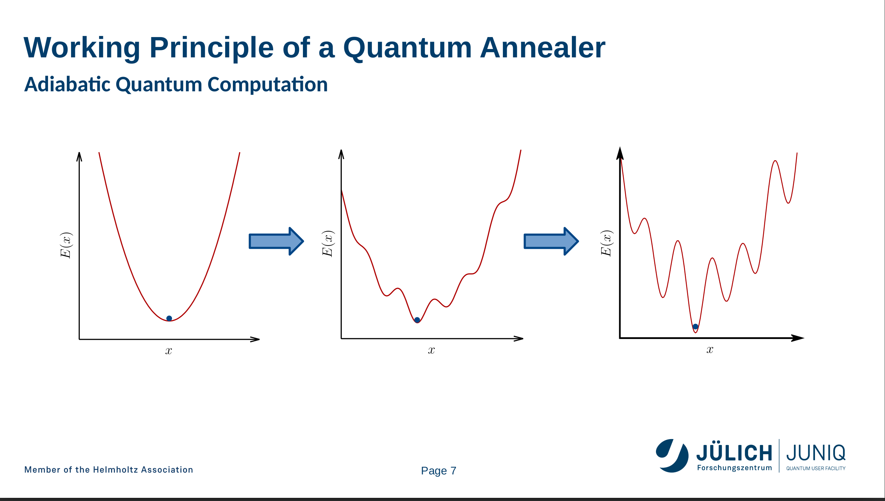
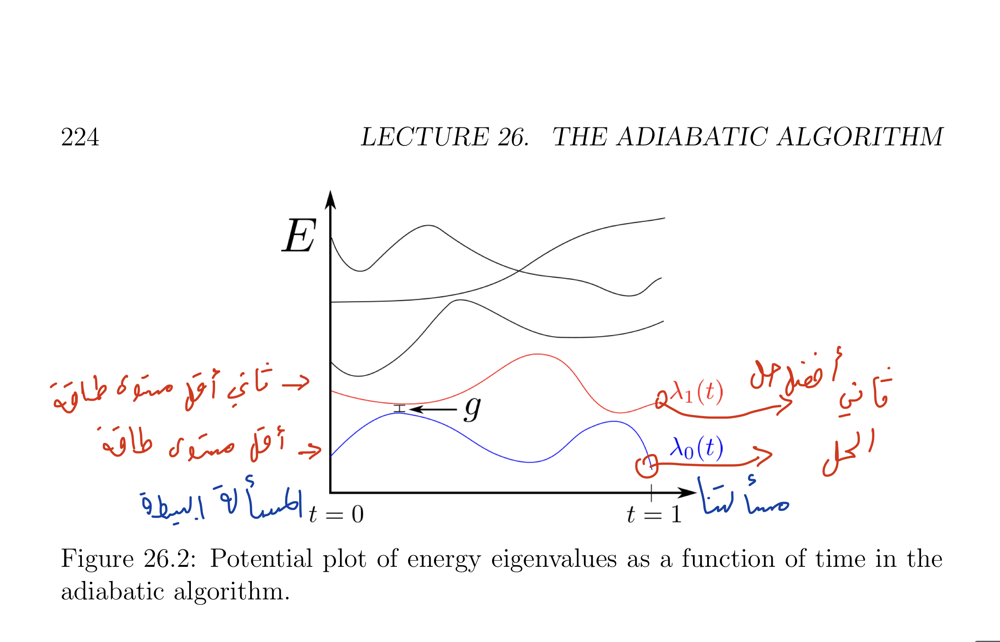
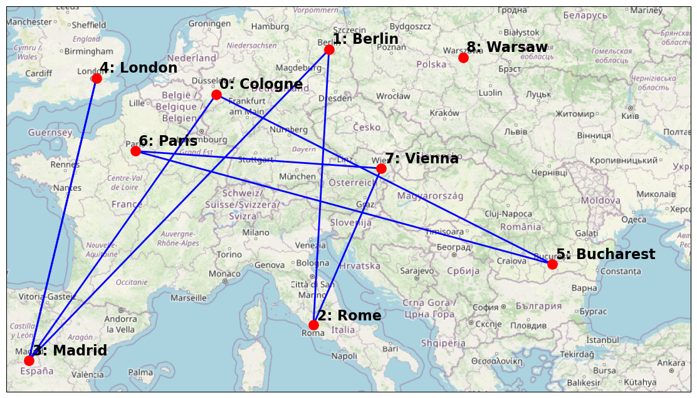
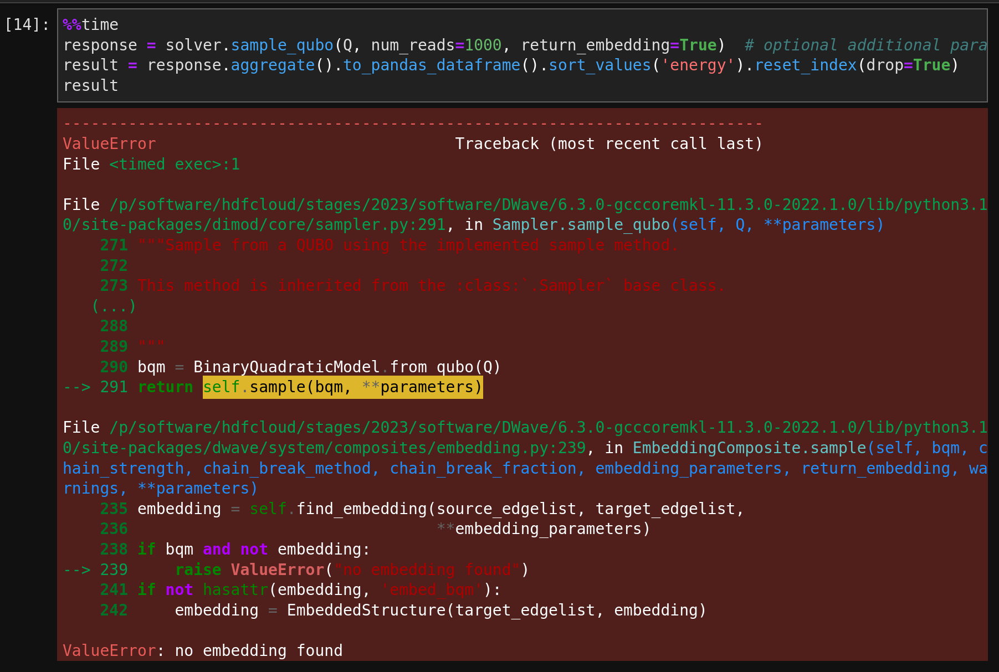
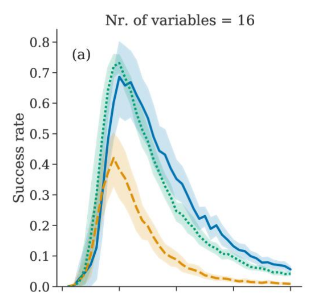
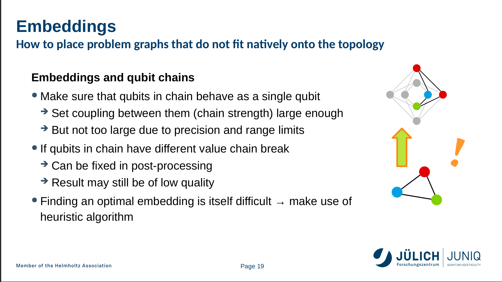
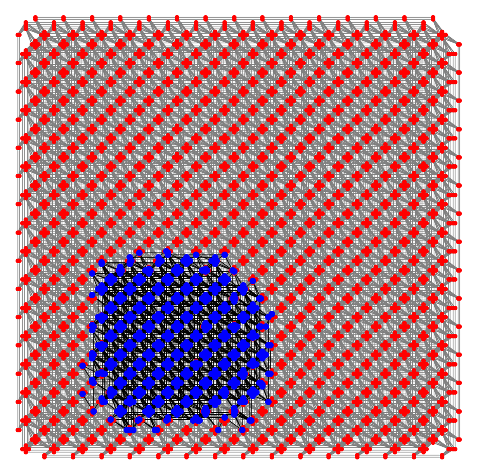



## مقدمة

كنت منبهر من دعاية د-ويف D-Wave عن الكوانتم كمبيوتر (الحاسب الكمي) Quantum Computer ب5627 كيوبت. وحصلت لي فرصة هذا الأسبوع لحضور مدرسة صيفية عن الكوانتم الأنيلر في معهد يوليش للأبحاث Forschungszentrum Jülich. 

أنا جدا ممتن للمنظمين على إتاحتهم الفرصة لجميع المهتمين لتجربة الكوانتم الكمبيوتر  وتدريبهم عليه تقريبا بلا مقابل. للمقارنة لو أراد شخص تدريب من شركة دي-ويف D-Wave سيدفع تقريبا 1000 دولار، ولتجربة الكمبيوتر سيدفع 4000 دولار لصلاحية وصول لمدة شهر (بدورة يوليش صلاحية الوصول أكثر من شهر!)

وخلاصة انطباعي إن كمبيوتر دي-ويف مخيب للآمال وقدرته في الواقع عليها علامات استفهام كثيرة، وبالنسبة لي أرى من الأفضل لي استخدم كمبيوتر عادي.

 في هذه المقالة سنرى بشكل مبسط كيف يعمل الكوانتم أنيلر (الكوانتم كمبيوتر المبني على الأنيلر)، وما هي سرعة حله للمسائل. وبعدها سنرى أداء كمبيوتر دي-ويف في الواقع.

## كيف يعمل كمبيوتر الكوانتم أنيلر

ملاحظة: المجال ما هو تخصصي لكني حاولت أراجع فهمي مع شخص متخصص.

الكوانتم أنيلر يحل المسألة التالية:

$$ min_{x_i = 0, 1} \left(\sum_{i=0}^{N-1} a_i x_i  + \sum_{i<j}^{N-1} b_{ij} x_i x_j  \right)$$

هذه المسألة NP-Hard، ولا يعني أنها غير قابلة للحل ولكن وقت الحل على الأسوأ أسي. 

والمبهر بالموضوع إن هذه المعادلة تمثل نظام فيزيائي بإمكاننا إنشائه وأقل طاقة يكون فيها هذا النظام الفيزيائي هو ما يقابل الحل لمعادلتنا!

بشكل أدق نبدأ بنظام فيزيائي بسيط بأقل طاقة وضع(أقصى اليسار بالرسمة)، ومن ثم نغير النظام ببطء حتى نصل للنظام اللذي يمثل مسألتنا (أقصى اليمين). وبحسب النظرية الأساسية للكوانتم الأنيلر فإن هذا سيضمن لنا عندما نصل للنظام اللذي يمثل مسألتنا بأننا سنكون بأقل طاقة وضع، على فرض إن حركتنا كانت بطيئة بشكل كافي.

ولنرى تفصيل أكثر لما يعني ببطء، نتحاج أن نرى رسمة مستويات الطاقة اللتي يمكن أن يكون النظام فيها :

لو قرأنا الرسم من الأسفل للأعلى سنرى أن المنحنى بالأسفل يمثل أقل طاقة وضع يمكن أن يكون فيها النظام، والمنحنى الأعلى منه ثاني أصغر طاقة  وضع للنظام.

 

وفي أقصى اليسار النظام البسيط الذي ابتدأنا فيه، وكل ما اتجهنا لليمين يزيد الوقت ويتغير النظام حتى نصل للنظام اللذي يمثل مسألتنا.

 

وفي الرسمة هناك قيمة بارزة باسم g، هذه القيمة هي أقل فرق بين المستوى الطاقة الأدنى مقارنة بمستوى الطاقة الأعلى. وتبين  أن الوقت اللي نحتاجه يتماشى

$$\frac{1}{g^2}$$

أي كل ما قل الفرق كل ما احتجنا وقت أكثر، لو قل فرق الطاقة إلى الثلث لاحتجنا ل9 أضعاف الوقت!
هذا أول خبر سيء، والخبر الأسوأ إن g تقل أسيا مع مرور الوقت! لمعرفة تفاصيل أكثر راجع محاضرات سكوت آرنسون وابحث عن Spectral Gap. وبالنسبة لي هي المشكلة الأساسية بجهاز دي-ويف،  ولكن المشاكل لا تنتهي هنا.

## تجربة لكمبيوتر دي-ويف

حاولت حل مسألة المسافر بجهاز دي-ويف بين 10 مدن (باختصار نبحث عن أقصر مسار يمر بين جميع المدن):
وبعد 100 قراءة وأخذ المتوسط بينها، أعطاني حل خاطئ (لاحظ مدينة وارسو Warsaw ما يزورها):

وحاولت تجربة المسألة على 15 مدينة وأعطاني الخطأ التالي:

لنرى أولا مشكلة دقة الحل، أحد المحاضرين عرض هذه الرسمة

والتي تقول باختصار، بعد حد معين  كل ما كبر حجم المسألة كل ما كانت دقة الحل أسوء!

أما مشكلة التضمين (من دخول بتفاصيل)، عندما ندخل مسألة لكمبيوتر دي-ويف فإننا نصف روابط بين الكيوبتات، ولكن بكمبيوتر دي-ويف ليست كل الكيوبتات متصلة ببعضها.
 

دي-ويف تحل المسألة بمعاملة أكثر من كيوبت كأنه كيوبت واحد، كما هو موضح في الصورة التالية:

في تجربتنا لتسعة مدن كان تضمين المسألة كالتالي:

## خاتمة

كان سقف توقعاتي عالي وكنت أتوقع ربما أستطيع كمبيوتر دي-ويف لإيجاد نتيجة جديدة، وتبين لي إنها أحلام يقظة في الوقت الحالي. في هذه المقالة تجاوزت شرح النفق الكمي، حيث لا أعرف متى إن المسألة ستسفيد من هذه الظاهرة.

## مراجع
<ul dir="ltr">
<li> Introduction to Quantum Information Science II Lecture Notes by Scott Aaronson </li>
<li> Quantum Information Processing – Applications on Gate-based and Annealing System </li>
</ul>

